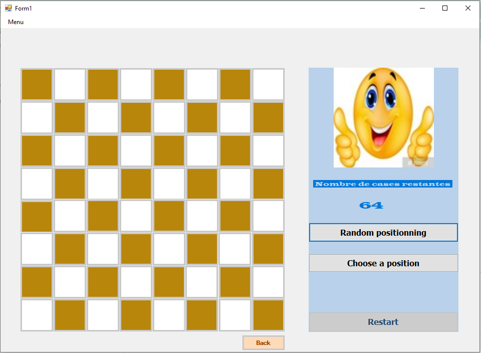

# Jeu du Cavalier (Windows Forms - C#)


## Fonctionnalités

- Affichage graphique d’un échiquier interactif.
- Sélection d’une position de départ aléatoire ou définie par l’utilisateur.
- Indication des déplacements valides du cavalier.
- Vérification automatique si le cavalier ne peut plus bouger.
- Bouton Restart pour recommencer une partie.
- Option de retour en arrière d’un coup.
- Personnalisation des couleurs de la grille.
- Gestion de la fermeture sécurisée de l'application.

## Installation

1. **Cloner le projet depuis GitHub** :
   ```sh
   git clone https://github.com/DjomoElisabeth/Jeu-du-cavalier.git
   
   ```
2. **Ouvrir le projet dans Visual Studio** :
   - Aller dans **Fichier > Ouvrir > Projet/Solution**.
   - Sélectionner le fichier `Echuiquier.sln`.
3. **Restaurer les packages NuGet** :
   - Aller dans **Outils > Gestionnaire de packages NuGet > Gérer les packages pour la solution**.
   - Installer les dépendances si nécessaire.
4. **Compiler et exécuter** :
   - Sélectionner **Debug** et cliquer sur **Exécuter** (`F5`).

## Utilisation

1. Démarrer l’application.
2. Choisir une position de départ manuelle ou aléatoire.
3. Déplacer le cavalier en suivant les cases indiquées (`X`).
4. Si aucun mouvement n’est possible, le jeu s'arrête.
5. Utiliser Restart pour recommencer ou Retour pour annuler le dernier coup.
6. Changer la couleur de la grille via le menu.

## Technologies utilisées

- C# (.NET Windows Forms)
- Visual Studio


